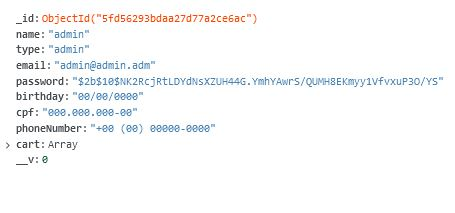
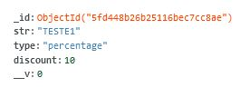
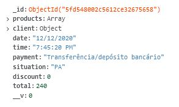
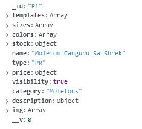

# Grupo - 1: Site de Secretaria Acadêmica - SA-SHREK

__Nome e nºUSP:__  
_Beatriz Helena Dias Rocha    11300051_  
_Juliana Bernardes Freitas    11317928_  
_Lucas Henrique Sant'Anna     10748521_  
_Lucas Viana Vilela           10748409_  
_Rafaela Cristina Bull        11233651_  
  
------------------------------------------  
  
# Relatório do Projeto: E-Commerce
## SCC219 - Introdução ao Desenvolvimento Web

### 1. Requerimentos  

Os requerimentos pedidos e adicionados particularmente para esse projeto foram:  

  - Dois tipos de usuários: cliente e administradores;
  
  - A loja deve vender produtos, serviços, eventos ou todos. No caso de produtos ou eventos, o item pode ser selecionado e sua quantidade escolhida, bem como outras opções (como modelagem, cor e tamanho). O pagamento será feito por meio de transferência bancária ou por PicPay. A quantidade do produto comprado é decrementada do número em estoque;
  
  - Uma conta (cliente ou administrador) deve ter ao menos os seguinter dados: nome, email, CPF, número de celular e data de nascimento.
  
  - Administradores têm acesso crud aos produtos, eventos, serviços e cupons ;
    
  - Os produtos devem ter ao menos os parêmetros: nome, id, fotos, descrição, preço e quantidade em estoque;
   
  - O administrador consegue criar/atualizar/ler/deletar produtos. Essa funcionalidade foi implementada perfeitamente;  
  
  - Implentar uma funcionalidade única à loja.
  
  - O sistema deve ser responsivo, ter acessibilidade e usabilidade.
  
  
  
  
    
    
    

-----------------------------
### 2. Descrição do Projeto  

  
O e-commerce aqui implementado é voltado para o uso de uma extracurricular universitária (especificamente, uma Secretaria Acadêmica) para suas eventuais vendas de produtos (como peças de roupas) e eventos (como viagens técnicas ou cursos).
    
 - O cliente pode escolher entre visualizar as páginas de produtos e eventos. Para comprar, seleciona as especificação do item (tamanho, quantidade, modelagem e quantidade) e adiciona-o ao carrinho de compras, tendo a possibilidade de inserir um  cupom de desconto. Então, seleciona-se a forma de pagamento e confirma-se a compra, para concluí-la.
 
 - Contas e itens (produtos ou eventos) guardam diversos registros que os classificam, idetificam e carregam com sigo propriedades para serem usadas dentro a implementação. Dentre essas, destaca-se:
    - __Contas:__ id, nome, tipo da conta (cliente ou administrador), email, senha, data de nascimento, CPF e número de telefone;  
   
    - __Itens:__ 
       
      - _Produtos:_ nome, tipo (nesse caso, produto), id, visibilidade, categoria, descrição, modelagens, tamanhos, cores, preço, imagem, imagem com as medidas do     produto e estoque.  
        
      - _Eventos:_  nome, tipo (nesse caso, evento), id, visibilidade, categoria, descrição, informações (local, data, horário, link relacionado), preço e estoque.  
   
- O gerenciamento dos itens é realizado pelos administradores, através da __Página do Administrador__, onde conseguem visualizar e editar todos os produtos cadastrados (inclusive os que não estão visíveis aos clientes), podendo alterar todas suas propriedades e também criar produtos novos. Além disso, conseguem ver os pedidos realizados e seus status, bem como atualizá-los. Por fim, podem visualizar todos os usuários cadastrados e seus principais dados - a edição dos usuários será implementada para a próxima entrega, juntamente com a edição e cadastro de cupons de desconto. Outras funcionalidades estão atreladas as Usuários e Cupons. No primeiro o administrador consegue visualizar os detalhes dos usuário, mudar o tipo da conta (entre cliente e administrador) e excluir usuários de menor hierarquia. A aba Cupons possibilita a crição e exclução de cupons, escolhendo o nome, tipo (Porcentagem ou Valor Cheio) e valor de desconto. Essa última funcionalidade estabele a loja um diferencial. 

- No servidor implementado, o qual escolheu-se o MongoDB, foi armazenado quatro tipos de informações. Abaixo temos cada uma delas com exemplos de como elas são armazenadas no servidor, tendo suas classes e valores. 
  - __account:__ 
  
    
 
  - __cupons:__
  
    
  
  - __orders:__
  
    
    
  - __products:__
  
    
    
 
 
O projeto foi desenvolvido tendo em vista os aspectos a seguir:  
- __Acessibilidade:__   
   Além de resursos de acessibilidade padrão, como texto alternativo para imagens e placeholders em campos de input, foram implementados recursos de menor presença nos projetos web. Dentre eles: a presença de um tema escuro (modo de contraste) para o site e a página _Acessiblidade_, linkada no rodapé do site, que detalha melhor esses elementos.   
   
  
      
- __Usabilidade:__  
A aplicação foi implementada até aqui para ser funcional e entregar ao usuário aquilo que ele procura. Em questão de design, o site apresenta páginas limpas que mostram apenas o essencial para que o usuário saiba onde está e o que deve fazer, além de botões e links que apresentam suas funções de forma lógica e dentro dos hábitos de navegação dos consumidores. Tomou-se cuidado, também, em utilizar cores que não comprometam a legibilidade dos elementos.
A divisão dos  produtos dentro do site é clara: as duas principais categorias são produtos e eventos, logo ambos aparecem diretamente na barra de navegação. Ao passar o mouse  por cima do botão, um menu _dropdrow_ aparece apresentando as subcategorias. Clicar no botão do menu inicial te leva para uma página de geral, mostrando os itens da categoria selecionada. Outro modo de chegar até o produto é digitar seu nome ou da sua subcategoria na caixa de pesquisa.  
Tendo em vista que a função do usuário administrador é fazer a gestão da loja, todas funções relacionadas a isso estão inclusas em uma única página, na  __Página do Administrador__: 
      
    
      
- __Responsividade:__  
Os componentes da página foram implementados e estruturados para serem responsivos para qualquer tamanho de tela de computador, utilizando recursos como _flexbox_, outros elementos foram criados com bootstrap e têm responsividade garantida. O site tem em sua versão final responsividade mobile. A imagem abaixo mostra a home do site em uma tela mobile. 

  
 
------------------------------------ 
### 3. Comentários sobre o código  
  
#### 3.1. Front-end  
Por característica do ___React___, tem-se que o arquivo html principal do site, o _index.html_ (abaixo), não possui nenhum conteúdo de fato, apenas uma div vazia. O ___React___ No momento de compilação, o ___React___ insere os componentes na ```div#root```, de acordo com o especificado _App.js_. 

```
 <body>
    <noscript>Para acessar esse site, você deve permitir o uso de JavaScript-BR.</noscript>
    <div id="root"></div>
  </body>
```

Analisaremos o _App.js_, usando ele como referência dentro do projeto, pois é o agregador de todas os outros elementos que compões as páginas. Veja que da linha 10 a 24 de seu código temos importações dos componentes, que, exceto a _Navbar_ e o _Footer_, representam cada uma das páginas.

``` 
10  import Navbar from './components/Navbar'
11  import Footer from './components/Footer'
12  import Home from './components/Home'
13  import Login from './components/Login'
14  import ProductsPanel from './components/ProductsPanel'
15  import ProductCategoryPanel from './components/ProductCategoryPanel'
16  import ProductSearch from './components/ProductSearch'
17  import ProductDetails from './components/ProductDetails'
18  import ShoppingCart from './components/ShoppingCart'
19  import Accessibility from './components/Accessibility'
20  import { DataContext } from './Context'
21  import MyAccount from './components/MyAccount'
22  import AdmAccount from './components/AdmAccount'
23  import ProductEdit from './components/ProductEdit'
24  import Checkout from './components/Checkout'
```

Na linha 35 se inicial uma _div_ onde tudo está contido, mas o que nos interessa é linha seguinte. Nela verifica-se se o argumento ```props.match.base === 'checkout'``` é verdadeiro ou não e apenas no caso negativo o componente ```<Navbar {...this.props}/>``` aparece na tela, sendo ela a navbar padrão do site, onde se encontra o menu principal, caixa de pesquisa e os botões do carrinho e de login e a opção de mudar as cores do site. Isso significa que quando o primeiro parâmetro da url ofor 'checkout', a navbar padrão não será utilizada. O motivo disso é  que há uma navbar específica para as telas de finalização da compra (checkout), que está contida na tag <Checkout/>, utilizada mais abaixo no código. O mesmo é feito em relação do footer, na linha 124, pois nenhum footer será utilizado durante o checkout.

```
35  <div id='app'>
36      <Route path='/:base*' render={props => props.match.params.base === 'checkout' ? '' : <Navbar {...this.props}/>}/>
            .
            .
            .
124     <Route path='/:base*' render={props => props.match.params.base === 'checkout' ? '' : <Footer/>}/>
125  </div>      

``` 


O conteúdo que aparecerá no componente App é definido de forma semelhante, porém com uso de elementos importados da bilioteca React Router DOM, que permite a criação de um site com estilo Single-Page Application. Veja um trecho abaixo. 

```
<Switch>
            {/* Pages */}
            <Route path='/' exact={true}><Home/></Route>

            <Route path='/:base' render={props => {
              const {base} = props.match.params

              if(['home', 'início'].includes(base.toLowerCase())){
                return <Redirect to='/'/>
              }

              else if(base.toLowerCase() === 'login'){
                return <Login {...props}/>
              }

              else if(['login', 'cadastro', 'cadastrar', 'cadastro', 'signup'].includes(base.toLowerCase())){
                return <Redirect to='/login'/>
              }

              else if(['eventos', 'events', 'event'].includes(base.toLowerCase()) || 
                ['produtos', 'products', 'product'].includes(base.toLowerCase())){
                return <ProductsPanel {...props}/>
              }
              
    .
    .
    .
    
</Switch>

```

As tags de <Route/> servem para renderizar diferentes componentes (páginas) de acordo com os parâmetros passados na URL e o switch, para garantir que apenas uma página seja utilizada por vez. A checagem dos parâmetros é feita utilizando listas com os parâmetros aceitos e a função ```toLowerCase()```, definida no arquivo _Util.js_, juntamente com outras funções auxiliares.

Para possibilitar compartilhamento e sincronia de dados, de forma global, entre os diversos componentes da árvore definida nesse arquivo, utilizou-se a Context API. O arquivo _Context.js_ é o responsável por essa integração, ele armazenando os dados de forma dinâmica durante a execução da aplicação - simulando, inclusive, o que seria o _backend_.


#### 3.2. Back-end

As requisições do projeto já definiam a criação de um servidor pelo Node.js, utilizando o Express. A partir disso, vamos analisar algumas comando fundamentais para implementação do back-end, explicando as principais bibliotecas node inseridas.

No arquivo index.js, há o seguinte trecho de código logo no início.

```

1 const cors = require('cors')
2 const express = require('express')
3 const mongoose = require('mongoose')
4 const app = express()

```
A linha 2 importa o Express, uma framework do Node que soluciona diversas tarefas e para esta aplicação é fundamental. Na linha 4 o Express é inicializado.
Como o banco de dados escolhido foi o MongoDB, é necessário utilizar um módulo que realize a tradução das informações no banco de dados objetos JavaScript para serem utilizados pela aplicação, o Mongoose é esse módulo. Na linha 3 ele está sendo importado.

Por fim falaremos da linha 1. Como se pode observar, tendo em vista as linhas 2 e 3, ele está importando um módulo chamado Cors. A necessidade do Cors advém de uma funcionalidade dos navegadores que impossibilita um recurso de um site ser chamado por uma página em domínio distinto. Como o servidor e a página se encontram nesse exato caso, o Cors então se torna necessario pois possibita a livre comunicação entre domínios. 

```
6 const apiRouter = require('./routes')
7 const db = require('./connection')
8
9 require('dotenv').config();
```
Na linha 9 temos a importação e inicialização do Dotenv, que gerencia variáveis de ambiente de um projeto por meio de um arquivo .env, possibilitando executar a aplicação em qualquer lugar. A linha 6 , ele define os caminhos para todas a ações sobre os dados no bando de dados, seja eles das contas, pedidos, produtos ou cupons. Na pasta router é possível observar separadamente por tipo de dado todas as ações que podem ser executadas. A linha 7 apenas chama o código do arquivo connection.js, abaixo podemos vê-lo.

```
1 const mongoose = require('mongoose')
2 require('dotenv').config()
3
4 mongoose.connect(process.env.DB_URL, {useNewUrlParser: true, useUnifiedTopology: true})
5
6 module.exports = mongoose.connection

```

A linha 4 realiza a conexão do banco de dados, até aqui estamos com uma conexão pendente como o banco de dados. A linha 6 inicia a execução para uma conexão de fato, o resntante do processeo está no arquivo index.js, onde temos o trecho abaixo.  

```

23 db.on('error', console.error.bind(console, 'connection error:'))
24 db.once('open', () => app.listen(process.env.SERVER_PORT, () => console.log(`Example app listening at http://localhost:` + process.env.SERVER_PORT)))

```


--------------------------------  

### 4. Procedimentos de compilação  

Esse projeto tem um conjunto de passos para que se possa visualizar suas implementações. Primeiramente, é necessário a instalação de um _package manager_: _Node.js_ ou _Yarn_. Recomendamos o _Yarn_, que utilizaremos para a explicação.


  
Com o _Yarn_ instalado, acesse o terminal do seu computador e vá até a pasta __back-end__ do repositório. Para instalar as dependências do projeto, como jQuery, listadas no arquivo _package.json_, basta utilizar o comando abaixo:

```
yarn install
```


Em seguida, para visualizar o projeto, utilize o comando abaixo:

```
yarn start
```
O comando irá iniciar o server operando na porta 7000, se não estiver ocupada. Retornado o link http://localhost:7000. Na pasta __front-end__ do projeto coloque os mesmo comandos, abrirá assim um host local para a visualização de desenvolvimento do app, normalmente na porta 3000 do localhost, se estiver disponível - http://localhost:3000., sendo variante se este já estiver em uso por outra aplicação. A tela inicial do site é mostrada abaixo.


  

  
  
--------------------------------------------    
### 5. Problemas  

 Durante o desenvolvimento do projeto diversos obstáculos apareceram e foram superados ao com a familiarização com as tecnologias utilizadas. Dentre elas, destaca-se:
  
  - Fazer animações com CSS e jQuery;
  
  - Sincronizar dados entre os diversos componentes da árvore;
  
  - Validação de formulários em _client-side_;  
  
  - Uso de máscaras nos formulários, para campos que deveriam ser formatados segundo um padrão rígido, como CPF: 000.000.000-00;
  
  - Uso de múltiplos contextos em um componente;
  
  - Aprender e implementar todo o back-end em tempo muito limitado.
  
  - Fazer a responsividade do site
  

--------------------------------------------
### 6. Comentários  
 
Tendo em vista o contexto e escopo do site (de Secretaria Acadêmica) decidiu-se não ser necessário a coleta de endereços e cartões de crédito. Ordinariamente as SAs (e extracurriculares da USP no geral) não trabalham com o envio dos produtos, ou com pagamento via cartão, mas sim de forma substancialmente local, com a retirada dos pedidos na sala da SA e o pagamento via depósito/transferência bancária ou online (como PicPay, ferramente amplamente utilizada entre universitários).
 
Destaca-se algumas informações para a navegação e teste do site:
 
- __Login:__ Há algumas uma conta de administrador pré-cadastrada. A conta cliente pode ser criada rapidamente.
   
  >__Conta Adminis:__  
  >Email: admin@admin.adm
  >Senha: Admin123
    
- __Cupom:__ Os cupons de desconto cadastrados estão abaixo, mas é possível criar novos com uma conta administradora.

  >__Cupom de 10% de desconto__  
  >TESTE1

  >__Cupom de R$25,00 de desconto__  
  >TESTE2
