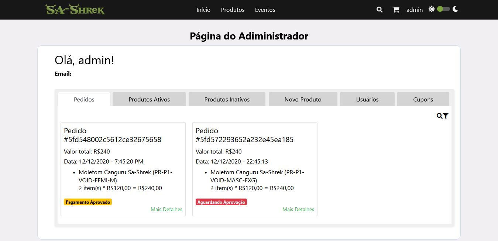

__Nome:                     | nºUSP:__  
_Beatriz Helena Dias Rocha   | 11300051_  
_Juliana Bernardes Freitas   | 11317928_  
_Lucas Henrique Sant'Anna    | 10748521_  
_Lucas Viana Vilela          | 10748409_  
_Rafaela Cristina Bull       | 11233651_  

__Grupo - 1: SITE SA-SHREK__ 
  
------------------------------------------  
  
# Relatório do Projeto: E-Commerce
## SCC219 - Introdução ao Desenvolvimento Web

### 1. Requerimentos  

-----------------------------
### 2. Descrição do Projeto  

  
  A descrição do projeto em sua versão final requeria para a presente etapa já algumas funcionalidades. Porém como o e-commerce aqui implementado é voltado para servir a uma entidade universitária para suas eventuais vendas de artigos e eventos, algumas particularidades foram adicionadas aos requerimentos iniciais. E resumo os requerimentos são estes:  
  - Dois tipos de usuários:  
    - Cliente - Esse tipo de conta conseguem escolher os produtos que deseja comprar e percorrer todo o processo para realizar o pedido. 
    
    - Administrador - Uma conta de administrador consegue adicionar novos administradores e gerencia-los, assim como pode fazer o mesmo para contas cliente. Também gerencia o estoque dos itens e o fluxo de pedidos. 
    
    
 - Como a SA-SHREK vende produtos então seguimos os requerimentos correspondetes a tal. Isto é, o cliente pode escolher entre produtos e eventos. Selecionando, quando habilitado, as especificação do item (tamanho, quantidade e modelagem) e adicionando-o ao carrinho de compras. Passando por todo o processo até concluir a compra e escolhendo no caminho outras especifiações do pedido, como por exemplo a forma de pagamento. Nas especificações fornecidas cosntava o cartão de crédito como uma forma de pagamento, utilizamos na implementação apenas transferências por essa ser a opção mais dentro do contexto onde a loja está inserida, mas para a versão final planeja-se incluir a opção sugerida para fins de demonstração. Foi incluido ainda nesse projeto a funcionalidade de cupons de desconto.  
 
 - Clientes, Administradores e os Itens da Loja guardam diversos registros que os classificam, idetificam e carregam com sigo propriedades para serem usadas dentro a implementação. Esses registros estão abaixo:   
   - __Registros dos Clientes:__ name, type (que nesse caso será 'client'), e-mail, password, birthday, cpf, phoneNumber;  
   
   - __Registros dos Administradores:__ name, type (admin), e-mail, password, birthday, cpf, phoneNumber;  
   
   - __Registros de Itens:__ Devemos aqui fazer uma pequena distição entre os dois tipos de itens vendidos na loja. Podemos perceber muitors registros semelhantes, mas entre o tipo Produtos e Eventos há particularidades que melhor representam aquilo que será vendido. Muitas vezes alguns desses registros não são utilizados, deixam seu valor em _null_.  
       
       _Produtos:_ name, type(os produtos são do tipo 'PR'), id, visibility, category, description, templates, sizes, colors, price(full, sale), img, sizeTable (uma imagem que contêm todos os tamanhos do produto), stock(quantidade em estoque).  
       
       _Eventos:_  name, type('EV'), id, visibility, description, templates, sizes, colors, info(location, date, time, link), price(full, sale), stock.  
   
 - O gerenciamento dos Produtos, e até mesmo de usuários, é realizado pelos administradores. Esses usuários especiais administram a loja pela __Página do Administrador__ onde conseguem ter o controle de todos os produtos que são vendidos na loja, podendo editar suas propriedades (Nome, Imagens, texto da Imagem, Preço, Preço com desconto, Tipo, Categoria, Descrição e Quantidade) e opção de escolha (Modelagem, Tamanho e Cor). Conseguem ver os pedidos realizados e seus status, assim como produtos cadastrados no site, mas que não estão visíveis aos clietes. Outra aba desta página é a Novo Pedido, onde há a opção de cadastras novos produtos especificando as propriedades já citadas. A ultima aba contém todos os usuários cadastrados, por ela se administra tanto cliente quanto administradores dependendo da hierarquia. 
 
   
 
 
 
 - Foram implementados ao projeto funcionalidades e ferramentas para prover cada um dos itens a seguir:  
   - __Acessibilidade:__   
   Além de resursos de acessibilidade padrão, como texto alternativo para imagens, foram implementados recursos de menor presença nos projetos web. O primeiro é a mudança de cores das páginas para torna-las acessiveis para daltônicos. Tal recurso pode ser visualizado mudando o botão na parte direita do cabeçalho. O outro recurso permite dar uma no site, aumentado o tamanho de todos os elementos da página. Essas funcionalidade menos difundidas são apresentas na página _Acessiblidade_ com link no rodapé do site.   
   
      
      
   - __Usabilidade:__  
   A aplicação foi implementada até aqui para ser funcional e entregar ao usuário aquilo que ele procura. Em questão de design, o site apresenta páginas limpas que mostram apenas o essencial para que o usuário saiba onde está e o que deve fazer. Botões e links que apresentam suas funções de forma lógica e dentro dos hábitos de navegação dos consumidores. Como o site foi desenvolvido pensando para vendas em uma pequena comunidade e com uma pequena diversidade de produtos, não é mostrado durante o processo de verificação da compra outros produtos além daquele que o usuário selecionou para o seu carrinho de compras. Temos assim um circuito linear e sem ramificações que leva da seleção do produto à confirmação da compra, algo não aconselhável para grades e-commerces, mas que é ideal para o contexto.  
   
      A arquitetura de informação do site é bastante lógica e simples. As conexões entre links, menus e outros elementos são práticos e funcionais. A divisão dos  produtos dentro do site é clara, as duas principais categorias são artigos físicos e eventos, logo ambos aparecem diretamente no menu da cabeçalho. Ao passar o mouse  por cima do botão, um menu _dropdrow_ aparece apresentando as subcategorias. Clicar no botão do menu inicial te leva para uma página de geral com um filtro lateral que mostra só os produtos da subcategoria seleciona. Outro modo de chegar até o produto é digitar seu nome ou da sua subcategoria na caixa de pesquisa.  
   
      Muitas facilidades podem ser encontras também para um usuário do tipo administrador. Como o objetivo do administrador é fazer a gestão da loja, todas suas funções foram divididas por abas e  colocadas na já citada __Página do Administrador__. Abaixo é possível visualiazar a página. 
      
        
      
   - __Responsividade:__  
   Os componentes da página foram implementados para serem responsivos para qualquer tamanho de tela de computador. Grande parte do site não foi configurado para se adaptar para telas mobile, tendo suas estruturas sido definidas dentro das folhas de estilo CSS. Outros janelas e compoenentes, por serem construídos com o framework Bootstrap, têm responsividade com dispositivos mobile, porém são exceções de modo que não há uma página inteira que se mostre compatível em um table ou celular. 
 
------------------------------------ 
### 3. Comentários sobre o código  
  
  
Apesar do projeto estar muito bem estruturado pela organização que o React permite, é necessário explicar alguns ponto de sua estrutura se quisermos iniciar uma análise sobre o código. 

```
 <body>
    <noscript>Para acessar esse site, você deve permitir o uso de JavaScript-BR.</noscript>
    <div id="root"></div>
  </body>
```
Ao observarmos o <body> do arquivo _index.html_ (pasta _public_), vemos que a única coisa existente é um _div_ de ```id="root"_```. Isso já é parte da utilização da biblioteca __React__ que no arquivo _index.js_ (pasta _src_) utiliza o método abaixo para que  _App.js_ seja o contéudo do elemento com ```id ="root"```.  
  
```
import { DataProvider } from './Context'

ReactDOM.render(<DataProvider><App/></DataProvider>, document.getElementById('root'))
```
-------> falar do DataProvider

Analisaremos o _App.js_, usando ele como referência dentro do projeto. Afinal ele é o agregador de todas os outros elementos componentes que serão nossas páginas. Veja que da linha 10 a 25 do código temos importações de componentes que como a _Navbar_ e o _Footer_ ou então o conteúdo das páginas.

``` 
10  import Navbar from './components/Navbar'
11  import Footer from './components/Footer'
12  import Home from './components/Home'
13  import Login from './components/Login'
14  import ProductsPanel from './components/ProductsPanel'
15  import ProductCategoryPanel from './components/ProductCategoryPanel'
16  import ProductSearch from './components/ProductSearch'
17  import ProductDetails from './components/ProductDetails'
18  import ShoppingCart from './components/ShoppingCart'
19  import Accessibility from './components/Accessibility'
20  import { DataContext } from './Context'
21  import MyAccount from './components/MyAccount'
22  import AdmAccount from './components/AdmAccount'
23  import ProductEdit from './components/ProductEdit'
24  import Checkout from './components/Checkout'
25  import { CheckoutProvider } from './components/CheckoutContext'

```

Temos então todas as páginas serão contruidas por meio do Componente App. Vamos até a linha 35, nela se inicial uma _div_ onde tudo está contido, mas o que nos interessa é linha seguinte. Nela acontece um teste, se o argumento ```props.match.base === 'checkout'``` é verdadeiro ou não, em caso negativo o componente ```<Navbar {...this.props}/>``` aparece na tela, sendo ela a navbar padrão que aparece na página, onde se encontra o Menu, caixa de pesquisa e botão do carrinho de compras, botão de login (ou da conta) e a opção de mudar as cores do site. Isso porque 'checkout' é propriedade que define a navbar do processo de final de compra (Carrinho de compras, Comfirmação de conta, Modo de Pagamento, Confirmação da Compra e Agradecimento pela Compra).  

```
35  <div id='app'>
36      <Route path='/:base*' render={props => props.match.params.base === 'checkout' ? '' : <Navbar {...this.props}/>}/>
            .
            .
            .
124     <Route path='/:base*' render={props => props.match.params.base === 'checkout' ? '' : <Footer/>}/>
125  </div>      

``` 

Uma condicional semelhante define o _Footer_ que ira aparecer dependendo do conteúdo da página.  

O conteúdo que aparecerá no componente App é definido de forma semelhante, ou pouco mais complexa, mas de lógica semelhante. Veja um trecho abaixo. 

```
<Switch>
            {/* Pages */}
            <Route path='/' exact={true}><Home/></Route>

            <Route path='/:base' render={props => {
              const {base} = props.match.params

              if(['home', 'início'].includes(base.toLowerCase())){
                return <Redirect to='/'/>
              }

              else if(base.toLowerCase() === 'login'){
                return <Login {...props}/>
              }

              else if(['login', 'cadastro', 'cadastrar', 'cadastro', 'signup'].includes(base.toLowerCase())){
                return <Redirect to='/login'/>
              }

              else if(['eventos', 'events', 'event'].includes(base.toLowerCase()) || 
                ['produtos', 'products', 'product'].includes(base.toLowerCase())){
                return <ProductsPanel {...props}/>
              }
              
    .
    .
    .
    
</Switch>

```
Observe que depois que ele define ```const {base} = props.match.params```, a função ```toLowerCase()``` da ```base``` que retorna se a página atual onde o usuário está é alguma dos fornecidas para teste. Assim define-se qual conteúdo deve ser mostrado, sendo que muitas páginas permanem a mesma, mudando apenas componentes internos. No código temos o exemplos de ```eventos```, ```events```, ```event```, ```produtos```, ```products``` e ```product```. Temos que existem condionametos nesse formato para todos os componentes importados lá no código mais para cima.  


--------------------------------  

### 4. Build Procedures  

Esse projeto tem um conjunto de passos para que se possa visualizar suas implementações. Primeiramente alguns softwares são necessários:  

  - Um editor de texto para: A escolha de algum em específico é definida pela preferência, mas escolher um que lhe permita uma visualização dos arquivos organizados dentro da pasta do projeto é fundamental.
  - Node.js: que será nosso ambiente de execução JavaScript no servidor.  
  
Para baixar o Node.js basta ir até o site https://nodejs.org/pt-br/ e escolher o arquivo especificado para seu computador e depois instalar.  

Com o Node.js instalado, acesse o terminal do seu computador e vá até a pasta __front-end__ do arquivo baixado do GitHub. O próximos comandos serão dados dentro dessa pasta, que é onde esta o arquivo _package.json_.  

É necessário instalar o Jquery, uma biblioteca de funções JavaScript que interage no HTML. Essas funções foram usadas amplamente no projeto e a ausência da biblioteca indicaria erro. Para instalar basta colocar o comando 

```
npm install jquery --save
```

O próximo passo já é a execução do projeto, onde o visualiazamos por meio de um servidor web criado pelo Node.js. Digite o comando abaixo para iniciar esse processo

```
npm start
```

No navegador abrirá uma nova aba com a seguinte URL: http://localhost:3000/ e tela a baixo aparecerá  


  

  
  
--------------------------------------------    
### 5. Problemas  

  - Durante o desenvolvimento do projeto diversas dificuldades apareceram, muitas delas por falta de experiência com as novas tecnologias necessárias para a implementação de funcionalidades fora do escopo básico. Ou talvez seja melhor avaliado como dificuldades em utilizar tecnologias nada básicas, apesar de úteis e amplamente utilizadas no mercado, como foi o caso de React e Jquery, ou até mesmo CSS. Tranzendo maior especifidade à discussão, os  problemas enfretados até aqui, foram: 
  
  - Fazer animações com CSS e Jquery se mostrou um trabalho, que apesar de estéticamente importante, também carrega consigo muito conhecimento e minúcia sobre estes dois tópicos, conhecer sua documentação para aplicar o necessário para aquilo que deseja. Foram muitas as vezes que utilizou-se de funções inadequadas para se fazer determinado efeito e isso resultou em tentivas de correção igualmente inadequadas, quando não inúteis;  
  
  - Como em React basicamente tudo é componente, as relações entres eles é imprescindível. Mas sincronizar dados entre eles também se mostra uma tarefa muito complicada, pois os dados fluem naturalmente em um sentido, de ```Componentes Pai_``` para ```Componentes Filho```, mas temos toda uma família de componentes que precisam se relacionar. Felizmente utilizando um componete ```Context``` foi possível cria uma forma viável de sincrozar os componentes que assim necessitavam estar;      
  
  - Há algo que não parece complicado, uma trivialidade para alguém de fora, o site preecher na vertical todo o espaço da tela, independente da quantidade de contúedo contido. Entedner melhor o CSS foi a solução;  
  
  - Formulários também se mostraram complicadores, para ser mais especifico no que diz respeito a validação em _client-side_ e _input mask_;  
  
  - Na segunda etapa do projeto, não foi necessário implementar tudo em React, mas também trabalhar com componetes que utilizavam multíplos contextos. Tarefa difícil de gerenciar e que agrava o problemas centreal, a dificuldade de implementar;  
  
  - Por fim apareceram pro fim a passagem de toda plataforma para essa nova tecnologia podia deixar pontas soltas, evidenicias erros escondidos ou incompatibilidades. Resumindo pequenos e médios _bugs_ que atrapalharam o desenvolvimento do projeto e que demandavam mais resistência que habilidade. 
  

--------------------------------------------
### 6. Comentários  
 
 - Gostariamos de ressaltar a escolha inicial de não utilizar o cartão de crédito como forma de pagamento e da não necessidade de existir no registro o endereço do cliente, pois a entrega de produtos não é uma opção. O site em desenvolvimento é de uma entidade acadêmica representativa dos alunos de um especifico curso, intituto ou departamento, sendo uma comunidade bem restrita e que trabalha de forma substancialmente local. Tanto suas relações sociais, quanto comerciais, se dão em grande parte de modo presencial com seus colaboradores. Nesse contexto, as ferramentas digitais auxiliam na comunicação e no acesso à processos que presencialmente seriam de pouco valor a ambos os lados e gerariam apenas burocracias, isso justifica por si só a existencia dessa plataforma. Dentro dessa comunidade local, a entrega de produtos não apenas não é viável, como também ilógica dada a distância que o fornenedor está dos clientes, sendo que esses transitam frequentemente pelo espaço onde o outro se encontra. Quanto ao cartão de crédito, é de praxe que SAs, CAs ou DAs não trabalhem com cartão de crédito em seus sites, utilizando mais transferencias/depósitos, pagamentos presenciais ou o PicPay, ferramenta muito difundida entre os universitários.  
 
 - Algumas informações para andar pelo site são necessárias:  
 
    - __Login:__ Há algumas contas registradas no site, tanto de cliente como de administrador. Elas dão acesso a possibilidade de comprar, acessar dados privados ou gerenciamento. Todas elas podem ser identificadas em _Context.js_, mas abaixo estão algumas delas para teste. 
   
      >__Conta Cliente:__  
      >teste@gmail.com  
      >Teste123  
      
      >__Conta Adminis:__  
      >admin@admin.adm
      >Admin123
      
      
    
   - __Cupom:__ Foi aplicado uma funcionalidade de inserir cupons de desconto aos produtos, para realizar o teste escreva.  
      
      >__Cupom de 10% de desconto__  
      >FLIPRULEZ10  
      
      >__Cupom de R$25,00__  
      >FLIPRULEZ25
      
      
